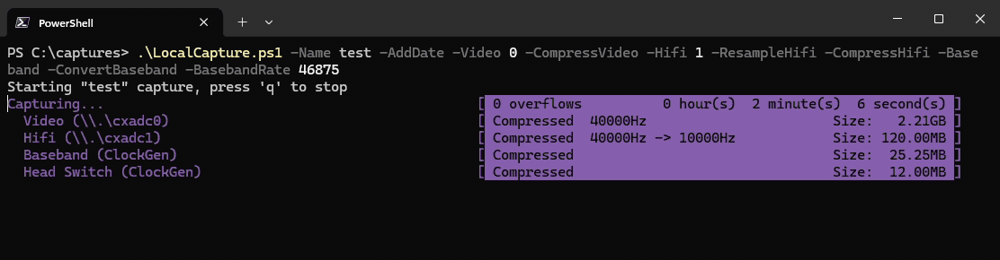

# cxadc-win - CX2388x ADC DMA driver for Windows
> [!WARNING]  
> ⚠️ **THIS IS EXPERIMENTAL** ⚠️  
> *This software is provided "as-is" and without any warranty nor liability. I am not responsible for any instability, security issues, conflicts with anti-virus and anti-cheat software, or any other problems arising from its use. I do not guarantee the accuracy or reliability of any captures made by this software.*
>    
> ⚠️ **THIS DRIVER IS UNSIGNED** ⚠️  
> *Due to security restrictions in Windows 10 and 11, **Secure Boot and Driver Signature Enforcement must be disabled** to allow the use of unsigned drivers. Please ensure you understand the potential security risks involved in disabling these features, and remember to re-enable them when you are not actively capturing.*  

This was made for use with the [decode](https://github.com/oyvindln/vhs-decode) projects, see [here](https://github.com/oyvindln/vhs-decode/wiki/CX-Cards) for more information on these cards.  


## Download
The latest release can be downloaded [here](https://github.com/JuniorIsAJitterbug/cxadc-win/releases).  


## Pre-installation  
1. Disable Secure Boot in your BIOS  
2. Disable Signature Enforcement
   <details>
     <summary>PowerShell (Administrator)</summary>

     ```
     PS> Set-BcdElement -Element "testsigning" -Type Boolean -Value $true
     ```
   </details>

   <details>
     <summary>Command Prompt (Administrator)</summary>

     ```
     > bcdedit -set testsigning on
     ```
   </details>


## Installation
1. Open **Device Manager**  
2. Right click **Multimedia Video Controller**, click **Properties**  
3. Click **Update Driver...**  
4. Click **Browse my computer for drivers**  
5. Browse to the path containing **cxadc-win.inf** and **cxadc-win.sys**, click **Next**  
6. Click **Install this driver software anyway** when prompted


## Post-installation
### PowerShell
1. PowerShell `≥7.4.0` is required, you can download the latest version [here](https://aka.ms/powershell-release?tag=stable)  
2. Allow the modules and scripts to run
    ```
    PS> Unblock-File .\CxadcWin.psm1,.\CxadcClockGen.psm,.\LocalCapture.ps1
    ```

### Capture server
The local capture script requires additional software.

<details>
<summary>Dependencies</summary>

  - [curl](https://curl.se/windows/) (required)
  - [FLAC](https://ftp.osuosl.org/pub/xiph/releases/flac/) (optional)
  - [SoX](https://sourceforge.net/projects/sox/) (optional)
  - [FFmpeg](https://www.gyan.dev/ffmpeg/builds/) (optional)
</details>

### Clockgen (optional)
The clockgen must be updated to work correctly on Windows.  
A pre-built firmware containing [these changes](src/clockgen#readme) is included in each release.  

### Disable device functions (optional)
> [!CAUTION]  
> This writes data to the EEPROM, if something goes wrong the card may be bricked  

This driver only uses the video function (`14F1:8800`).  
Device manager may be polluted with `Multimedia Controller` devices, these are unused and can be disabled.  

<details>
  <summary>View function state</summary>

  ```
  PS> Get-CxadcWinDeviceFunction -Path \\.\cxadc0

  Video Audio  MPEG    IR
  ----- -----  ----    --
   True  True False False
  ```
</details>

<details>
  <summary>Disable all unused functions</summary>

  ```
  PS> Set-CxadcWinDeviceFunction -Path \\.\cxadc0 -Disable All

  The following action will write data to the EEPROM, if something goes wrong the card may be bricked.
  Do you take full responsbility and wish to continue?
  [Y] Yes  [N] No  [S] Suspend  [?] Help (default is "Y"): y
  WARNING: A reboot is required for changes to apply.
  ```
</details>


## Usage
### Configure
Devices can be configured via the PowerShell module, WMI or Device Manager.

#### List devices
```
PS> Get-CxadcWinDevice

Path       InstanceName                                                      Location
----       ------------                                                      --------
\\.\cxadc0 PCI\VEN_14F1&DEV_8800&SUBSYS_45534E4F&REV_05\5&69f2177&0&080015_0 07:00.0
```

#### Get config and state of a device
```
PS> Get-CxadcWinConfig -Path \\.\cxadc0

Active         : True
CenterOffset   : 0
EnableSixDB    : False
EnableTenbit   : False
InstanceName   : PCI\VEN_14F1&DEV_8800&SUBSYS_45534E4F&REV_05\5&69f2177&0&080015_0
Level          : 16
VideoMux       : 2
PSComputerName :

PS> Get-CxadcWinState -Path \\.\cxadc0

Active             : True
InitialPage        : 0
InstanceName       : PCI\VEN_14F1&DEV_8800&SUBSYS_45534E4F&REV_05\5&69f2177&0&080015_0
IsCapturing        : False
LastGpCount        : 0
OverUnderflowCount : 0
ReaderCount        : 0
PSComputerName     :
```

#### Change device config
```
PS> Set-CxadcWinConfig -Path \\.\cxadc0 -VideoMux 1

Active         : True
CenterOffset   : 0
EnableSixDB    : False
EnableTenbit   : False
InstanceName   : PCI\VEN_14F1&DEV_8800&SUBSYS_45534E4F&REV_05\5&69f2177&0&080015_0
Level          : 16
VideoMux       : 1
PSComputerName :
```

Available parameters  
See [cxadc-linux3](https://github.com/happycube/cxadc-linux3) for parameter descriptions.  

Parameter       | PowerShell / WMI Property | Range  | Default 
----------------|---------------------------|--------|--------
`vmux`          | `VideoMux`                | `0-2`  | `2`
`level`         | `Level`                   | `0-31` | `16`
`tenbit`        | `EnableTenbit`            | `0-1`  | `0`
`sixdb`         | `EnableSixDB`             | `0-1`  | `0`
`center_offset` | `CenterOffset`            | `0-63` | `0`

Device values are stored in the registry at the following location  
`HKLM\SYSTEM\CurrentControlSet\Enum\PCI\VEN_14F1&DEV_8800&SUBSYS_XXXXXXXX&REV_XX\X&XXXXXXXX&X&XXXXXX\DeviceParameters`

### Configure clockgen (Optional)
#### Get device settings
```
PS> Get-CxadcClockGenDevice

DevicePath      : \\?\usb#vid_1209&pid_0002&mi_00#7&8abc8b&3&0000#{9ded1fd1-c739-4d2a-a1e5-e060342724de}
ClockRate0      : 28.63MHz
ClockRate1      : 28.63MHz
AdcRate         : 48000
Serial          : E66118604B118121
FirmwareVersion : 0
```

Get specific output.
```
PS> (Get-CxadcClockGenRate).ClockRate0
28.63MHz

PS> (Get-CxadcClockGenRate).AdcRate
48000
```

#### Get available options
```
PS> Get-CxadcClockGenDevice | Get-CxadcClockGenRateOptions

Output Values
------ ------
   ADC {48000, 46875}
Clock0 {20MHz, 28.63MHz, 40MHz, 50MHz}
Clock1 {20MHz, 28.63MHz, 40MHz, 50MHz}
```

#### Configure outputs
```
PS> Set-CxadcClockGenRate -Output Clock0 -Rate 40mhz
PS> Set-CxadcClockGenRate -Output Clock1 -Rate 40mhz
PS> Set-CxadcClockGenRate -Output ADC -Rate 46875
```  

### Capture
The capture-server is a [Windows port](src/capture-server#readme) of [cxadc_vhs_server](https://github.com/namazso/cxadc_vhs_server).  
Use `LocalCapture.ps1` to capture video, hifi and baseband audio, with optional resampling and compression.  



> [!NOTE]  
> `LocalCapture.ps1` does not support 10-bit captures  

#### Example: Single card (stock crystal, compressed)
```
PS> .\LocalCapture.ps1 -Name TestCapture `
                       -Video 0 -CompressVideo -VideoBaseRate 28636
```

<details>
  <summary>Details</summary>

  - Video data is captured and compressed from `\\.\cxadc0` using a sample rate of `28636`
    - Setting a base rate is required when the crystal/clockgen is not 40MHz
</details>

<details>
  <summary>Output files</summary>

  ```
  TestCapture-video.flac
  ```
</details>

#### Example: Single card + clockgen audio
```
PS> .\LocalCapture.ps1 -Name TestCapture `
                       -Video 0 `
                       -Baseband
```

<details>
  <summary>Details</summary>

  - Video data is captured from `\\.\cxadc0`
  - Audio is captured from a clockgen device
</details>

<details>
  <summary>Output files</summary>

  ```
  TestCapture-video.u8
  TestCapture-baseband.s24
  ```
</details>

#### Example: Single card + clockgen audio (compressed and converted)
```
PS> .\LocalCapture.ps1 -Name TestCapture `
                       -Video 0 -CompressVideo `
                       -Baseband -BasebandRate 46875 -ConvertBaseband
```

<details>
  <summary>Details</summary>

- Video data is captured and compressed from `\\.\cxadc0`
- Audio is captured, converted and compressed from a clockgen device with a sample rate of `46875`
</details>

<details>
  <summary>Output files</summary>

  ```
  TestCapture-video.flac
  TestCapture-baseband.flac
  TestCapture-headswitch.flac
  ```
</details>

#### Example: Dual card + clockgen audio (compressed, resampled and converted)
```
PS> .\LocalCapture.ps1 -Name TestCapture -AddDate `
                       -Video 0 -CompressVideo `
                       -Hifi 1 -CompressHifi -ResampleHifi `
                       -Baseband -BasebandRate 46875 -ConvertBaseband
```

<details>
  <summary>Details</summary>

- Video data is captured and compressed from `\\.\cxadc0`
- Hifi data is captured, resampled and compressed from `\\.\cxadc1`
- Audio is captured, converted and compressed from a clockgen device with a sample rate of `46875`
- A timestamp is added to the file names
</details>

<details>
  <summary>Output files</summary>

  ```
  TestCapture-20250601T1217596850-video.flac
  TestCapture-20250601T1217596850-hifi.flac
  TestCapture-20250601T1217596850-baseband.flac
  TestCapture-20250601T1217596850-headswitch.flac
  ```
</details>

#### Example: View available `LocalCapture.ps1` options
```
PS> Get-Help .\LocalCapture-ps1 -Full
```


## Other tools
### CVBS viewer (`cxcvbs`)
This driver works with a [fork](https://github.com/JuniorIsAJitterbug/cxcvbs) of cxcvbs.  


#### UltraLock
> [!IMPORTANT]
> This may not work if `level` is too high, or with non-stock crystal frequencies  

You can *"break"* the UltraLock by changing `HTOTAL`.  

<details>
  <summary>Set register to max then min</summary>

  ```
  PS> Set-CxadcWinRegister -Path \\.\cxadc0 -Address 0x310120 -Value 0x00017FF
  PS> Set-CxadcWinRegister -Path \\.\cxadc0 -Address 0x310120 -Value 0x0001000
  ```
</details>

Both `SCHERR` and `FCNTR` will be static if successful.  

<details>
  <summary>Check register values</summary>

  ```
  PS> Get-CxadcWinRegister -Path \\.\cxadc0 -Address 0x310100,0x310190
  ```
</details>

### GNU Radio
> [!NOTE]  
> There may be [issues](https://lists.gnu.org/archive/html/discuss-gnuradio/2024-11/msg00031.html) with the `Video SDL Sink` on Windows. (25/02/15)  

This driver works with GNU Radio, see [tandersn/GNRC-Flowgraphs](https://github.com/tandersn/GNRC-Flowgraphs/tree/main/test_cxadc) for example flowgraphs.  


## Building
This has only been tested with VS 2022 and WSDK/WDK 10.0.26100. 


## Credits
This is based on the Linux [cxadc](https://github.com/happycube/cxadc-linux3) driver, without which this would not exist. Thanks to the [Domesday86](https://discord.gg/pVVrrxd) discord for testing.  
