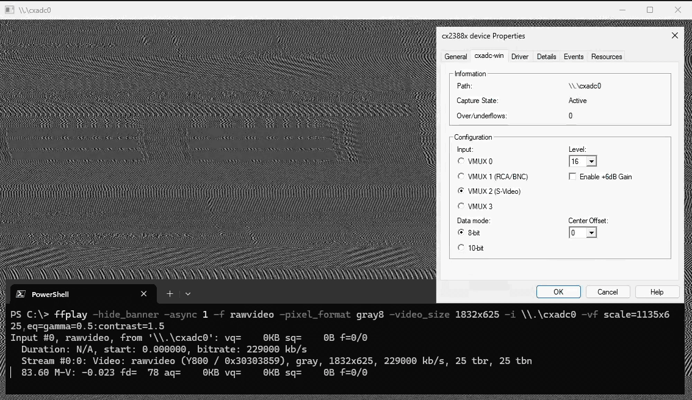
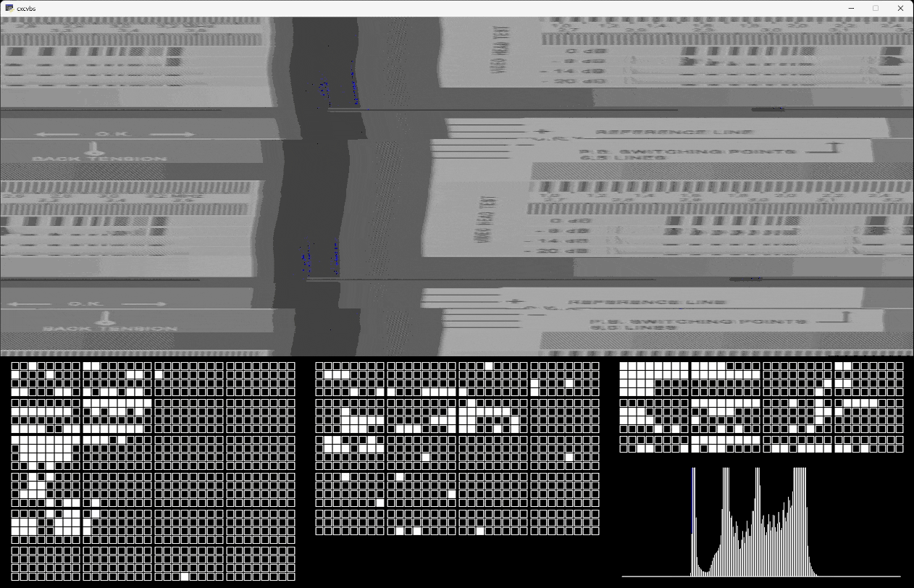
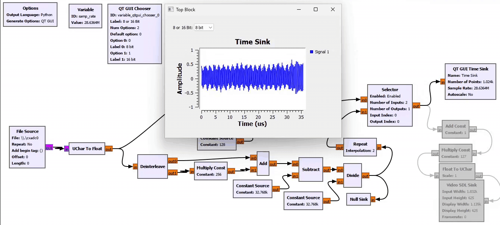

# cxadc-win - CX2388x ADC DMA driver for Windows
> [!WARNING]  
> ⚠️ **THIS IS EXPERIMENTAL** ⚠️  
> *This software is provided "as-is" and without any warranty. I am not responsible for any instability, security issues, conflicts with anti-virus and anti-cheat software, or any other problems arising from its use. I do not guarantee the accuracy or reliability of any captures made by this software.*  

This was made for use with the [decode](https://github.com/oyvindln/vhs-decode) projects, see [here](https://github.com/oyvindln/vhs-decode/wiki/CX-Cards) for more information on these cards.  



## Usage
### Configure
The device can be configured via `cxadc-win-tool`, WMI or Device Manager.  
```
cxadc-win-tool scan
cxadc-win-tool get <device>
cxadc-win-tool set <device> <parameter> <value>

cxadc-win-tool set \\.\cxadc0 vmux 1     # set cx card 0 vmux to 1 (bnc?)
cxadc-win-tool set \\.\cxadc1 vmux 1     # set cx card 1 vmux to 1 (bnc?)
cxadc-win-tool set \\.\cxadc0 level 0    # set cx card 0 level to 0 (amp?)
cxadc-win-tool set \\.\cxadc1 level 0    # set cx card 1 level to 0 (amp?)

cxadc-win-tool status                    # show all device config
```

```
PS> $CxCard0 = Get-CimInstance -Namespace "root/WMI" -ClassName CxadcWin_DeviceConfig |
  ? InstanceName -Eq (Get-CimInstance -Namespace "root/WMI" CxadcWin_DevicePath |
    ? Path -Eq "\\.\cxadc0").InstanceName
PS> $CxCard1 = Get-CimInstance -Namespace "root/WMI" -ClassName CxadcWin_DeviceConfig |
  ? InstanceName -Eq (Get-CimInstance -Namespace "root/WMI" CxadcWin_DevicePath |
    ? Path -Eq "\\.\cxadc1").InstanceName
PS> Set-CimInstance -CimInstance $CxCard0 -Property @{VideoMux=1;Level=0}
PS> Set-CimInstance -CimInstance $CxCard1 -Property @{VideoMux=1;Level=0;EnableTenbit=$True}

PS> Get-CimInstance -Namespace "root/WMI" -ClassName CxadcWin_DeviceState
PS> Get-CimInstance -Namespace "root/WMI" -ClassName CxadcWin_DeviceConfig
PS> Get-CimInstance -Namespace "root/WMI" -ClassName CxadcWin_DevicePath
```

See [cxadc-linux3](https://github.com/happycube/cxadc-linux3) for parameter descriptions.  

Parameter       | WMI Property   | Range  | Default 
----------------|----------------|--------|--------
`vmux`          | `VideoMux`     | `0-2`  | `2`
`level`         | `Level`        | `0-31` | `16`
`tenbit`        | `EnableTenbit` | `0-1`  | `0`
`sixdb`         | `EnableSixDB`  | `0-1`  | `0`
`center_offset` | `CenterOffset` | `0-63` | `0`

Device values are stored in the registry at the following location  
`HKLM\SYSTEM\CurrentControlSet\Enum\PCI\VEN_14F1&DEV_8800&SUBSYS_XXXXXXXX&REV_XX\X&XXXXXXXX&X&XXXXXX\DeviceParameters`  

#### Configure clockgen (Optional)

> [!IMPORTANT]  
> [Additional steps](#clockgen-optional) are required to configure clockgen

```
cxadc-win-tool clockgen audio get
cxadc-win-tool clockgen audio set <rate>
cxadc-win-tool clockgen cx get <clock>
cxadc-win-tool clockgen cx set <clock> <value>

cxadc-win-tool clockgen cx set 0 3       # set clock 0 to 40 MHz
cxadc-win-tool clockgen cx set 1 3       # set clock 1 to 40 MHz
cxadc-win-tool clockgen audio set 48000  # set audio sample rate to 48000 (recommended)
```

Value | Frequency (MHz)
------|----------------
`1`   | `20`
`2`   | `28.68686`
`3`   | `40`
`4`   | `50`

### Capture
> [!NOTE]  
> Use Command Prompt or [PowerShell ≥7.4.0](https://github.com/PowerShell/PowerShell) if piping to `STDOUT`  

```
cxadc-win-tool capture \\.\cxadc0 test.u8
cxadc-win-tool capture \\.\cxadc1 - | flac -0 --blocksize=65535 --lax --sample-rate=28636 --channels=1 --bps=8 --sign=unsigned --endian=little -f - -o test.flac
```

## Download
Builds are currently only available via [actions](https://github.com/JuniorIsAJitterbug/cxadc-win/actions). You must be logged in to download artifacts.  

## Pre-installation  
1. Disable Secure Boot in your BIOS  
2. Disable Signature Enforcement, this can be done by typing `bcdedit -set testsigning on` in an Administrator Command Prompt and rebooting  

## Installation
1. Open **Device Manager**  
2. Right click **Multimedia Video Controller**, click **Properties**  
3. Click **Update Driver...**  
4. Click **Browse my computer for drivers**  
5. Browse to the path containing **cxadc-win.inf** and **cxadc-win.sys**, click **Next**  
6. Click **Install this driver software anyway** when prompted

### Clockgen (Optional)
> [!NOTE]  
> This has only been tested with the [original](https://gitlab.com/wolfre/cxadc-clock-generator-audio-adc) clockgen, compatibility with [cxadc-clockgen-mod](https://github.com/namazso/cxadc-clockgen-mod) is not guaranteed (24/12/01)  

The [clockgen mod](https://github.com/oyvindln/vhs-decode/wiki/Clockgen-Mod) is configurable via `cxadc-win-tool`.  
1. Download the latest [libusb-win32](https://github.com/mcuee/libusb-win32) drivers  
2. Copy `bin\amd64\libusb0.dll` to `C:\Windows\System32`  
3. Copy `bin\amd64\libusb0.sys` to `C:\Windows\System32\drivers`  
4. Run `install-filter-win.exe` as Administrator, select **Install a device filter**  
5. Select `vid:1209 pid:0001 rev:0000 | USB Composite Device`, click **Install**	 

## Building
This has only been tested with VS 2022, WSDK/WDK 10.0.26100 and .NET 8.0.  

## Limitations
Due to various security features in Windows 10/11, Secure Boot and Signature Enforcement must be disabled. I recommend re-enabling when not capturing.  

## Known issues
#### Clockgen
- Windows reports incorrect audio sample rate, set to 48000 to avoid issues (24/12/01)
- The 3rd audio channel (HSW) does not work correctly (24/11/30) 

## Other tools
### CVBS viewer (`cxcvbs`)
This driver works with a [fork](https://github.com/JuniorIsAJitterbug/cxcvbs) of cxcvbs.  



#### UltraLock
You can *"break"* the UltraLock by changing `HTOTAL`.  
```
cxadc-win-tool register set \\.\cxadc0 0x310120 0x00017FF  # set to max
cxadc-win-tool register set \\.\cxadc0 0x310120 0x0001000  # set to min
```

> [!IMPORTANT]
> This may not work if `level` is too high, or with non-stock crystal frequencies  

Both `SCHERR` and `FCNTR` will be static if successful.
```
cxadc-win-tool register get \\.\cxadc0 0x310100
cxadc-win-tool register get \\.\cxadc0 0x310190
```

### GNU Radio
> [!NOTE]  
> There may be [issues](https://lists.gnu.org/archive/html/discuss-gnuradio/2024-11/msg00031.html) with the `Video SDL Sink` on Windows. (25/02/15)  

This driver works with GNU Radio, see [tandersn/GNRC-Flowgraphs](https://github.com/tandersn/GNRC-Flowgraphs/tree/main/test_cxadc) for example flowgraphs.  



## Credits
This is based on the Linux [cxadc](https://github.com/happycube/cxadc-linux3) driver, without which this would not exist. Thanks to the [Domesday86](https://discord.gg/pVVrrxd) discord for testing.  
